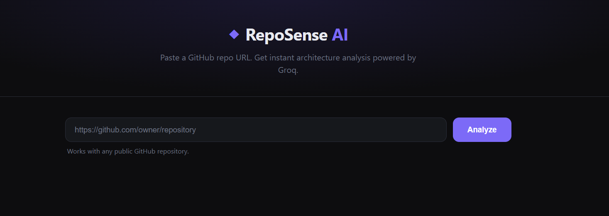

# RepoSense AI



A web app that analyzes any public GitHub repository and returns a structured AI-powered breakdown — architecture, tech stack, strengths, improvements, and a visual diagram — in under 30 seconds.

**Live demo:** https://reposenseai.onrender.com

---

## What it does

Paste a GitHub URL. RepoSense AI will:

- Fetch the repository's file tree and key source files via the GitHub API
- Send the context to Groq's LLM (llama-3.3-70b-versatile) for analysis
- Return a structured breakdown including:
  - **Summary** — what the repo does, who it's for, and a non-obvious technical observation
  - **Tech Stack** — all detected technologies, frameworks, libraries, and tools
  - **Architecture** — the architectural pattern, layers, and interesting design decisions
  - **Architecture Diagram** — a Mermaid.js flow diagram of the actual component structure
  - **What This Repo Gets Right** — specific strengths with file/pattern references
  - **Improvements** — concrete, actionable suggestions referencing actual code

---

## Tech Stack

| Layer | Technology |
|-------|-----------|
| Backend | ASP.NET Core (.NET 10) Web API |
| AI | Groq API — llama-3.3-70b-versatile |
| GitHub Integration | Octokit.NET |
| Frontend | Vanilla HTML, CSS, JavaScript |
| Diagram Rendering | Mermaid.js |
| Deployment | Docker on Render.com |
| Keep-alive | GitHub Actions (pings every 10 minutes) |

---

## Architecture

```
Browser → ASP.NET Core API → GitHubService (Octokit) → GitHub API
                           → GroqService (HttpClient) → Groq API
```

- **GitHubService** — fetches repo metadata (stars, forks, issues, dates), builds the file tree, and reads up to 12 key files while skipping binaries, lock files, and irrelevant folders
- **GroqService** — builds a structured prompt with the repo context, calls the Groq API, sanitizes the JSON response (handles raw newlines inside strings), and parses the result into a typed model
- **AnalysisController** — single POST `/api/analysis/analyze` endpoint that orchestrates both services and returns the result as JSON
- **Frontend** — static files served from `wwwroot`; renders each section with appropriate styling (bullet list, badges, numbered list, Mermaid SVG)

---

## Running locally

1. Clone the repo
2. Add your keys to `appsettings.Development.json`:
```json
{
  "GitHub": { "Token": "your_github_pat" },
  "Groq":   { "ApiKey": "your_groq_api_key" }
}
```
3. Run:
```bash
dotnet run
```
4. Open `http://localhost:8080`

**Get a free Groq API key:** https://console.groq.com
**Get a GitHub Personal Access Token:** GitHub → Settings → Developer settings → Personal access tokens

---

## Deployment

Deployed via Docker on [Render.com](https://render.com) free tier.
A GitHub Actions workflow pings the app every 10 minutes to prevent cold starts.

Environment variables required on the host:
- `Groq__ApiKey` — Groq API key
- `GitHub__Token` — GitHub Personal Access Token
